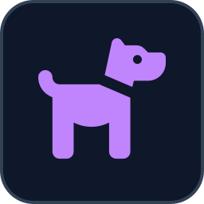

<p align="center">
  
</p>

# Tractive MQTT Bridge

<!-- BADGES:START -->

[](https://github.com/geoffmyers/tractive-mqtt-bridge/pkgs/container/tractive-mqtt-bridge)
[](LICENSE.md)
[](CONTRIBUTING.md)
<!-- BADGES:END -->

## Table of Contents

- [Description](#description)
- [Features](#features)
- [Requirements](#requirements)
- [Installation](#installation)
- [Usage](#usage)
- [Home Assistant](#home-assistant)
- [Configuration](#configuration)
- [Known limitations](#known-limitations)
- [Architecture](#architecture)
- [Credits](#credits)
- [Contributing](#contributing)
- [License](#license)

## Description

A cloud-poll and real-time-push bridge for [Tractive](https://tractive.com/)
GPS pet trackers. It authenticates against Tractive's own cloud API — the
same one the mobile app uses — and republishes live location, health and
activity metrics, and walk/geofence event history over MQTT with Home
Assistant [MQTT Discovery](https://www.home-assistant.io/integrations/mqtt/#mqtt-discovery).

Home Assistant has an official `tractive` integration, but it surfaces only
current location, battery and the buzzer/LED/live-tracking controls. This
bridge does not replace it — it runs **alongside**, publishing a much wider
slice of what Tractive's cloud actually tracks (activity minutes, sleep,
bark and scratch counts, resting-heart-rate and respiratory-rate biometric
monitors, geofence and walk events, and a real-time position push channel)
under its own separate Home Assistant device, so there's no entity
collision. It deliberately does **not** expose the buzzer, LED or
live-tracking controls — those mutate the tracker, and the official
integration already owns them.

## Features

- **Multi-pet**, discovered dynamically from your account — every tracked
  pet gets its own Home Assistant device.
- **Live position** via both a real-time push channel (near-instant updates
  while it's connected) and a polling backstop, exposed as a Home Assistant
  `device_tracker` for the Lovelace map plus raw latitude/longitude/
  altitude/speed sensors.
- **Health and activity metrics** the official integration doesn't expose:
  resting heart rate, respiratory rate, bark and scratch monitoring,
  daily/weekly activity goals with breed-benchmark comparisons, and sleep
  numerics.
- **Six health-alert monitors** (activity, long-term activity, heart rate,
  respiratory rate, separation, sleep) with their current status and alert
  history.
- **Walk and geofence event history** — safe-zone / danger-zone / power-
  saving-zone enter and exit, and daily activity-goal-reached events —
  published as one-shot MQTT events with their original timestamps, with a
  startup backfill window.
- **Automatic re-authentication** on token expiry and on any unexpected
  authentication failure.

## Requirements

- **Docker** with the Compose plugin (Compose v2.17+, for `additional_contexts`)
- An MQTT broker reachable from the container, with Home Assistant's MQTT
  integration pointed at the same broker
- A [Tractive](https://tractive.com/) GPS pet tracker already set up on a
  Tractive account

## Installation

```bash
git clone https://github.com/geoffmyers/tractive-mqtt-bridge.git
cd tractive-mqtt-bridge

cp .env.example .env
cp docker-compose.example.yml docker-compose.yml
```

Edit `.env` with your Tractive account credentials and MQTT broker details
(see [Configuration](#configuration)), then build and start the bridge:

```bash
docker compose build
docker compose up -d
docker compose logs -f
```

The application code is bind-mounted from `./app`, so after the first build
a code change only needs a container restart, not a rebuild.

The image is also published on the GitHub Container Registry as
`ghcr.io/geoffmyers/tractive-mqtt-bridge`, for `linux/amd64` and `linux/arm64`, with the
application code in it: `docker compose pull` fetches it instead of
building. The compose file still mounts `./app` over that copy, so the
code in your checkout is what runs.

## Usage

On startup the bridge logs in, discovers every pet tracker on your account,
publishes Home Assistant Discovery configs, backfills recent position and
event history, opens the real-time push channel, and starts its background
poll tiers. No further interaction is needed.

If a poll tier fails (for example, Tractive changes an endpoint's response
shape), that tier logs a warning and keeps retrying on its own schedule —
other tiers, other pets and the push channel are unaffected.

### Finding your TRACTIVE_USER_ID

The bridge needs your Tractive account's user ID (a 24-character hex string)
for the very first authenticated request it makes, so unlike the other
credentials it cannot discover this for you — it is required, not optional.
Get it with one manual request before your first deploy:

```bash
curl -s https://graph.tractive.com/4/auth/token \
  -H 'x-tractive-client: 625e533dc3c3b41c28a669f0' \
  -H 'content-type: application/json;charset=UTF-8' \
  -d '{"platform_email":"you@example.com","platform_token":"your-password","grant_type":"tractive"}' \
  | python3 -c 'import json,sys; print(json.load(sys.stdin)["user_id"])'
```

Save the printed value as `TRACTIVE_USER_ID` in `.env`. You only need to do
this once — the ID does not change.

## Home Assistant

Entities are grouped under two kinds of Home Assistant device:

| Device | Scope | Examples |
|---|---|---|
| `Tractive Bridge: <pet>` | Per pet | `device_tracker` on the Lovelace map, latitude/longitude/altitude/speed, position-accuracy quality, tracker battery/charging state, bark/heart-rate/respiratory-rate/scratch status + numerics, daily/weekly activity with breed comparison, sleep numerics, six health-alert monitor statuses + history, last walk/geofence-event mirrors |
| `Tractive Account` | Once per bridge | Account email, country/locale/units, sharing and subscription state |

## Configuration

Environment variables, set in `.env` (`.env.example` lists them all):

| Variable | Default | Description |
|---|---|---|
| `TRACTIVE_USERNAME` | *(required)* | Tractive account email |
| `TRACTIVE_PASSWORD` | *(required)* | Tractive account password |
| `TRACTIVE_USER_ID` | *(required)* | Your Tractive account's user ID (a 24-character hex string). The bridge does not discover this on its own — see [Finding your TRACTIVE_USER_ID](#finding-your-tractive_user_id) |
| `TRACTIVE_CLIENT_ID` | *(required)* | Tractive's own public API client id — see [Credits](#credits) |
| `MQTT_HOST` | `mosquitto` | MQTT broker hostname |
| `MQTT_PORT` | `1883` | MQTT broker port |
| `MQTT_USER` | *(empty)* | MQTT username |
| `MQTT_PASSWORD` | *(required)* | MQTT password |
| `MQTT_TLS` | `0` | Set to `1` for a broker that requires TLS |
| `MQTT_CA_FILE` | *(unset)* | Path to a custom CA bundle; leave unset to use the system trust store (only consulted when `MQTT_TLS=1`) |
| `FAST_POLL_INTERVAL` | `90` | Seconds; back-stop poll used when the real-time push channel is silent |
| `MED_POLL_INTERVAL` | `300` | Seconds; activity/bark/scratch/health-monitor/separation/event polls |
| `SLOW_POLL_INTERVAL` | `3600` | Seconds; weekly report, account, subscriptions, shares |
| `INTER_CALL_DELAY` | `0.4` | Seconds paused between sequential REST calls (Tractive rate-limits aggressively) |
| `POSITION_BACKFILL_HOURS` | `24` | Hours of position history to backfill on startup; Tractive rejects windows over 24h; `0` disables |
| `EVENT_BACKFILL_DAYS` | `30` | Days of walk/geofence event history to backfill on startup; `0` disables |
| `EVENT_TIMEZONE` | `UTC` | IANA timezone used for daily activity-goal event boundaries |
| `CHANNEL_ENABLED` | `1` | Set to `0` to disable the real-time push channel and rely on the fast poll alone |
| `HA_DISCOVERY_PREFIX` | `homeassistant` | Home Assistant MQTT Discovery topic prefix |
| `MQTT_TOPIC_PREFIX` | `tractive` | Prefix for this bridge's own MQTT topics |
| `LOG_LEVEL` | `INFO` | Python log level |
| `GITHUB_ERROR_TOKEN` | *(unset)* | Optional. A GitHub token with `repo` scope; when set together with `GITHUB_REPO`, uncaught exceptions are filed as GitHub issues via `repository_dispatch` (see [Credits](#credits)) |
| `GITHUB_REPO` | *(unset)* | Optional. `owner/name` of the repo to file error reports against |
| `GITHUB_ERROR_ENVIRONMENT` | `production` | Optional. Environment label attached to filed error reports |

## Known limitations

- **Mutation endpoints are deliberately skipped** — buzzer, LED,
  live-tracking toggle and mark-alerts-seen are already exposed by the
  official HA `tractive` integration; adding them here would create
  duplicate entities.
- **Position-history backfill is capped at 24 hours** — Tractive rejects
  longer windows on that endpoint with an HTTP 400. A longer backfill would
  need day-by-day pagination.
- **Some hardware sensors are always unavailable on certain tracker
  models.** For example, a clip-mounted / temperature sensor that a given
  hardware revision simply doesn't have stays permanently null; the bridge
  skips publishing an entity for a field it never sees a value for, rather
  than showing a permanently-`Unknown` sensor.
- **Subscription plan name is not resolved** — the subscriptions endpoint
  returns only an opaque reference id on this integration's tested account;
  resolving it to a plan name/renewal date needs a further per-id request
  that isn't wired in.

## Architecture

A background daemon thread consumes Tractive's real-time push channel while
independent poll tiers cover everything the push channel doesn't carry. See
[ARCHITECTURE.md](ARCHITECTURE.md) for the endpoint map, poll cadences and
module layout.

## Credits

- MQTT client, Home Assistant Discovery payloads and topic/timestamp helpers
  come from this repository's own `ha-mqtt-bridge-toolkit` package, vendored
  in at `_shared/ha-mqtt-bridge-toolkit/` when this repository is published.
- Optional production-error reporting uses this repository's own
  `python-github-error-reporter` package, vendored in the same way at
  `_shared/python-github-error-reporter/`.
- Tractive's cloud API is **not publicly documented**. The endpoints this
  bridge calls, the public API client id, and the regional event-timeline
  hostname were worked out from the community
  [`aiotractive`](https://github.com/Danie1S/aiotractive) library and by
  capturing the Tractive mobile app's own network traffic; they may change
  or break without notice.
- The README icon is the [Font Awesome](https://fontawesome.com/) `dog`
  glyph, used under [CC BY 4.0](https://creativecommons.org/licenses/by/4.0/).
- This project is not affiliated with, endorsed by, or supported by
  Tractive GmbH.

Written by Geoff Myers.

## Contributing

Bug reports and pull requests are welcome. See [CONTRIBUTING.md](CONTRIBUTING.md)
for setup, checks and how this repository is published.

## License

This program is free software: you can redistribute it and/or modify it under
the terms of the GNU General Public License as published by the Free Software
Foundation, either version 3 of the License, or (at your option) any later
version.

This program is distributed in the hope that it will be useful, but WITHOUT ANY
WARRANTY; without even the implied warranty of MERCHANTABILITY or FITNESS FOR A
PARTICULAR PURPOSE. See [LICENSE.md](LICENSE.md) for the full text of the GNU
General Public License.

SPDX-License-Identifier: `GPL-3.0-or-later`
